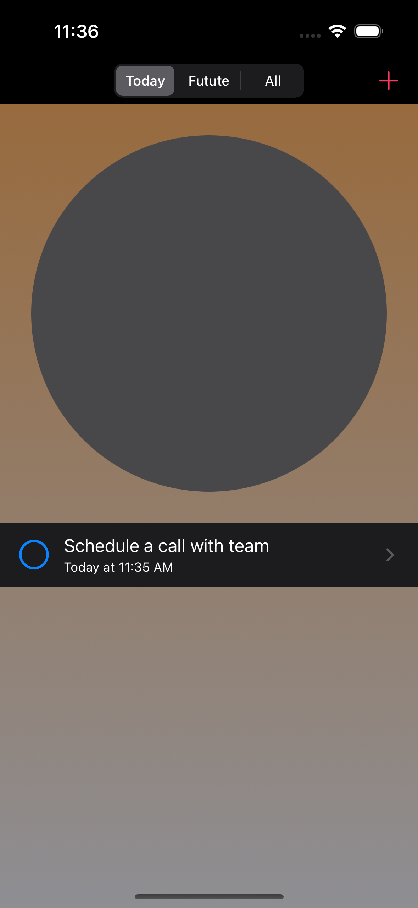
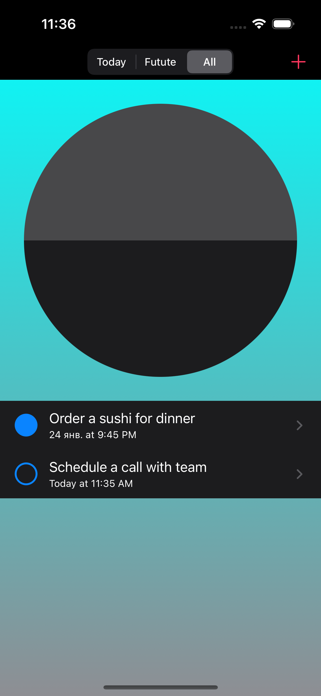
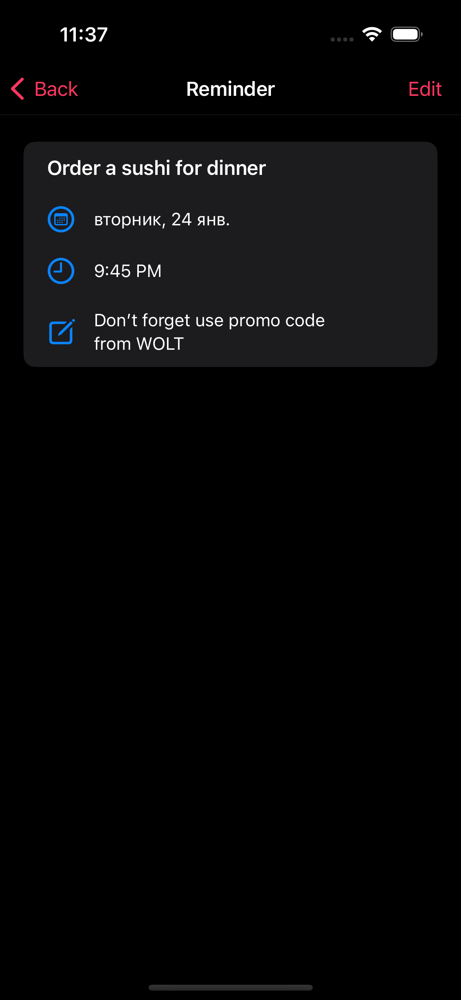
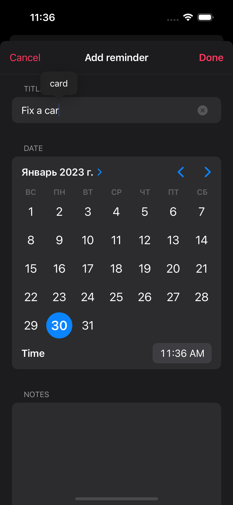

# iOS Swift UIKit Today App

### The Today app allows create, update, delete reminders    
### Reminders sync with the system reminder app via **EventKit** framework

### Technical features

* UIKit
* Swift 5.7
* EventKit
* Storyboard
* Programmatically created ViewControllers and Views
* Views Animation

    
    

    
    

